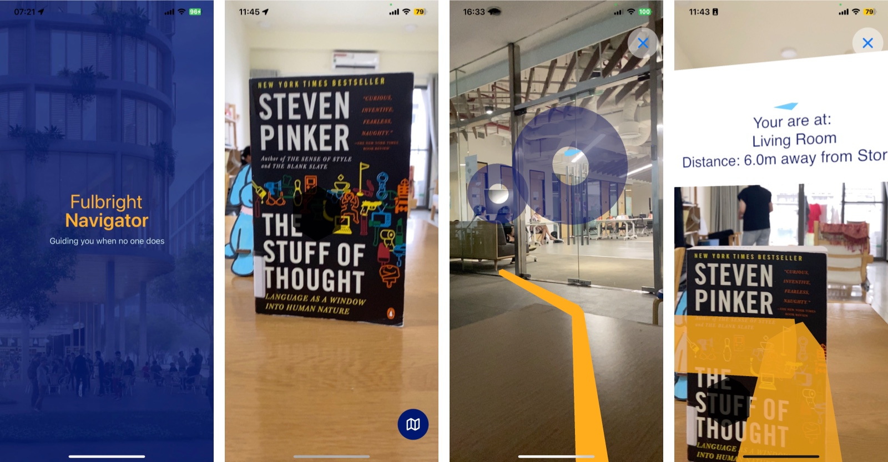

# Fulbright Navigator

This project is a software application for Fulbright that helps upcoming students find their way inside a campus building floor. It uses object recognition and 3D reconstruction to locate the user’s position and provide shorest directions to their destination. It can also show information about the location and the estimated distance to the destination.

You can find our recorded demonstration on [Google Drive](https://drive.google.com/file/d/1jHGFkr4yGbOnUsNLieo3s2S_bsND1loj/view?usp=share_link). The demonstration's goal is to find the shortest path from dining table to the storage room.